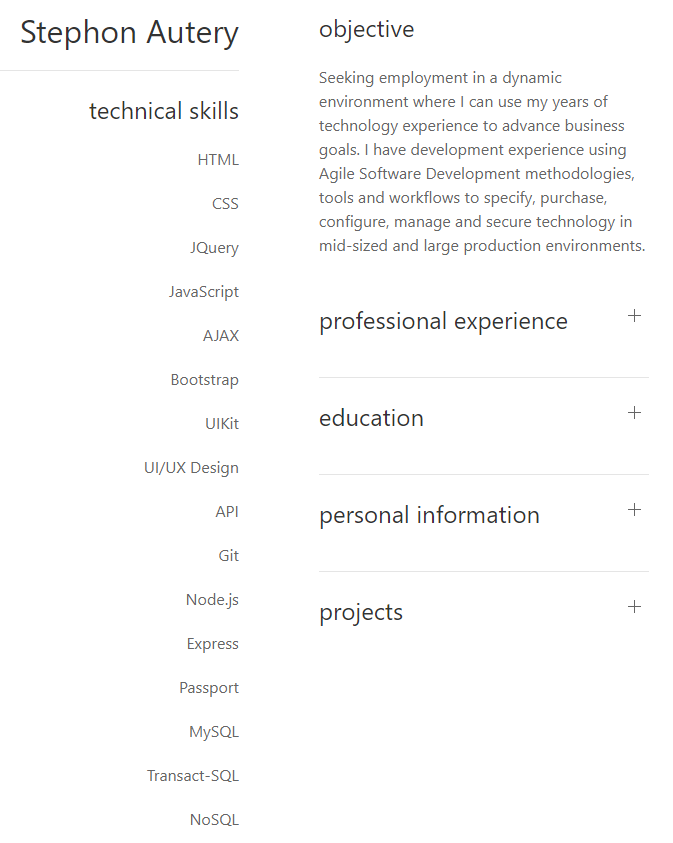

# Stephon-Autery-Portfolio
A portfolio built using UIKit.

css, javascript, UIKit CSS Framwork and JQuery are used.

## Site Picture

## Technologies Used
* [HTML](https://developer.mozilla.org/en-US/docs/Web/HTML)
* [CSS](https://developer.mozilla.org/en-US/docs/Web/CSS)
* [javaScript](https://developer.mozilla.org/en-US/docs/Web/JavaScript)
* [UIKit](https://getuikit.com/docs/introduction)
- React.js

## Deployed Link

* [see live site](https://desolate-hollows-13457.herokuapp.com/)
* [github repository](https://github.com/StephonAutery/react-portfolio)

## Authors

* **Stephon Autery** 

- [link to portfolio Site](https://github.com/StephonAutery)
- [link to LinkedIn](https://www.linkedin.com/in/stephon-a-1bb575198/)

## License

This project is in the public domain.

images: copyright Stephon Autery

## Acknowledgments

* UCBerkeley Coding Bootcamp is still Awesome!
